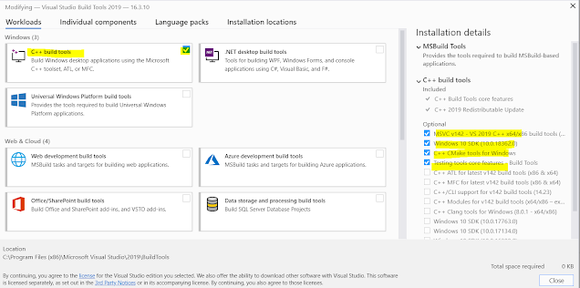

相关报错整理

```text
RUST error: linker `link.exe` not found

This is because of the absence of the C++ build tools in your machine
```

参考：

https://www.jaacostan.com/2019/12/rust-error-linker-linkexe-not-found.html

```text
-- 下载 Visual Studio
https://visualstudio.microsoft.com/zh-hans/thank-you-downloading-visual-studio/?sku=BuildTools&rel=16

vs_buildtools__4ff8731ac2f34afeba2a117c81d428ba.exe

This will download around 1.2GB of required files. Once everything is successfully installed, reboot and re-run your rust program and it will compile successfully.
```

