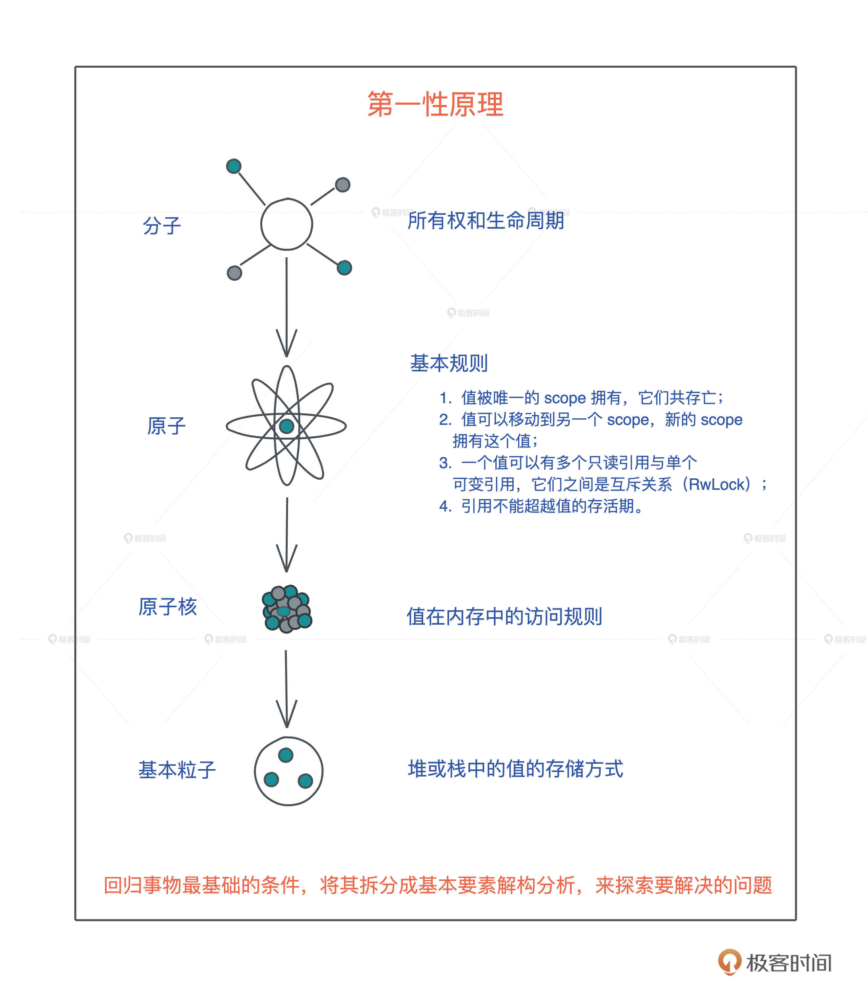
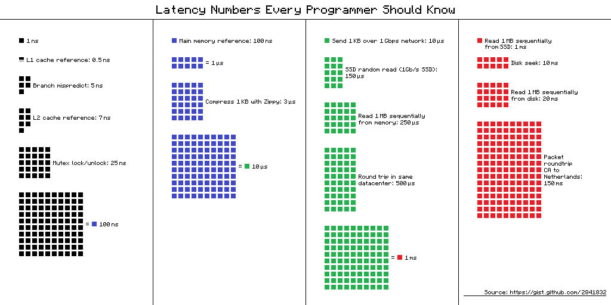

参考文档：

Rust官网

https://www.rust-lang.org/


Cargo中文手册

https://rustwiki.org/zh-CN/cargo/getting-started/installation.html


# 1、前置知识

Rust中最大的思维转换就是变量的所有权和生命周期，这是几乎所有编程语言都未曾涉及的领域。

**任何语言的学习离不开精准学习 + 刻意练习**


回归本原的重要性，也就是常说的第一性原理：回归事物最基础的条件，将其拆分成基本要素解构分析，来探索要解决的问题。



.jpg)

.jpg)

## 1.1、内存

一个简单的例子：

下面这个把 “hello world!” 赋值给 s 的简单语句中，就跟只读数据段（RODATA）、堆、栈分别有深度交互。

```rust
let s = "hello world".to_string();
```

首先，“hello world” 作为一个字符串常量（string literal），在编译时被存入可执行文 件的 .RODATA 段（GCC）或者 .RDATA 段（VC++）。

然后在程序加载时，获得一个固定的内存地址。 

当执行 “hello world”.to_string() 时，在堆上，一块新的内存被分配出来，并把 “hello world” 逐个字节拷贝过去。 

当我们把堆上的数据赋值给 s 时，s 作为分配在栈上的一个变量，它需要知道堆上内存的地址，另外由于堆上的数据大小不确定且可以增长，我们还需要知道它的长度以及它现在有多大。 


最终，为了表述这个字符串，我们使用了三个 word：

第一个表示指针、第二个表示字符 串的当前长度（11）、第三个表示这片内存的总容量（11）。

在 64 位系统下，三个 word 是 24 个字节。


数据什么时候可以放在栈上，什么时候需要放在堆上呢？

### 1.1.1、栈

栈是程序运行的基础。

每当一个函数被调用时，一块连续的内存就会在栈顶被分配出来， 这块内存被称为帧（frame）。

栈是自顶向下增长的，一个程序的调用栈最底部，除去入口帧（entry frame），就是 main() 函数对应的帧，而随着 main() 函数一层层调用，栈会一层层扩展；调用结束，栈又会一层层回溯，把内存释放回去。

在调用的过程中，一个新的帧会分配足够的空间存储寄存器的上下文。

在函数里使用到的通用寄存器会在栈保存一个副本，当这个函数调用结束，通过副本，可以恢复出原本的寄存器的上下文，就像什么都没有经历一样。

此外，函数所需要使用到的局部变量，也都会在帧分配的时候被预留出来。

.jpg)

那一个函数运行时，怎么确定究竟需要多大的帧呢？ 

这要归功于编译器。在编译并优化代码的时候，一个函数就是一个最小的编译单元。

在这个函数里，编译器得知道要用到哪些寄存器、栈上要放哪些局部变量，而这些都要在编译时确定。

所以编译器就需要明确每个局部变量的大小，以便于预留空间。

这下我们就明白了：在编译时，一切无法确定大小或者大小可以改变的数据，都无法安全地放在栈上，最好放在堆上。

比如一个函数，参数是字符串：

```rust
fn say_name(name: String) {}
// 调用
say_name("Lindsey".to_string());
say_name("Rosie".to_string());
```

字符串的数据结构，在编译时大小不确定，运行时执行到具体的代码才知道大小。


比如上 面的代码，“Lindsey” 和 “Rosie” 的长度不一样，say_name() 函数只有在运行的时候，才知道参数的具体的长度。 

所以，我们无法把字符串本身放在栈上，只能先将其放在堆上，然后在栈上分配对应的指针，引用堆上的内存。 


放栈上的问题 从刚才的图中你也可以直观看到，栈上的内存分配是非常高效的。

只需要改动栈指针 （stack pointer），就可以预留相应的空间；把栈指针改动回来，预留的空间又会被释放掉。

预留和释放只是动动寄存器，不涉及额外计算、不涉及系统调用，因而效率很高。 

所以理论上说，只要可能，我们应该把变量分配到栈上，这样可以达到更好的运行速度。 

那为什么在实际工作中，我们又要避免把大量的数据分配在栈上呢？

这主要是考虑到调用栈的大小，避免栈溢出（stack overflow）。

一旦当前程序的调用栈 超出了系统允许的最大栈空间，无法创建新的帧，来运行下一个要执行的函数，就会发生 栈溢出，这时程序会被系统终止，产生崩溃信息。

过大的栈内存分配是导致栈溢出的原因之一，更广为人知的原因是递归函数没有妥善终 止。一个递归函数会不断调用自己，每次调用都会形成一个新的帧，如果递归函数无法终止，最终就会导致栈溢出。 

### 1.1.2、堆 

栈虽然使用起来很高效，但它的局限也显而易见。

当我们需要动态大小的内存时，只能使用堆，比如可变长度的数组、列表、哈希表、字典，它们都分配在堆上。 

堆上分配内存时，一般都会预留一些空间，这是最佳实践。 


比如你创建一个列表，并往里添加两个值：

```rust
let mut arr = Vec::new();
arr.push(1);
arr.push(2);
```

这个列表实际预留的大小是 4，并不等于其长度 2。

这是因为堆上内存分配会使用 libc 提供的 malloc() 函数，其内部会请求操作系统的系统调用，来分配内存。

系统调用的代价是昂贵的，所以我们要避免频繁地 malloc()。 

对上面的代码来说，如果我们需要多少就分配多少，那列表每次新增值，都要新分配一大块的内存，先拷贝已有数据，再把新的值添加进去，最后释放旧的内存，这样效率很低。 

所以在堆内存分配时，预留的空间大小 4 会大于需要的实际大小 2 。 


**除了动态大小的内存需要被分配到堆上外，动态生命周期的内存也需要分配到堆上。 **

上文中我们讲到，栈上的内存在函数调用结束之后，所使用的帧被回收，相关变量对应的 内存也都被回收待用。

所以栈上内存的生命周期是不受开发者控制的，并且局限在当前调用栈。 

而堆上分配出来的每一块内存需要显式地释放，这就使堆上内存有更加灵活的生命周期， 可以在不同的调用栈之间共享数据。 

如下图所示：

.jpg)

放堆上的问题？

然而，堆内存的这种灵活性也给内存管理带来很多挑战。 

如果手工管理堆内存的话，堆上内存分配后忘记释放，就会造成内存泄漏。

一旦有内存泄 漏，程序运行得越久，就越吃内存，最终会因为占满内存而被操作系统终止运行。 

如果堆上内存被多个线程的调用栈引用，该内存的改动要特别小心，需要加锁以独占访问，来避免潜在的问题。

比如说，一个线程在遍历列表，而另一个线程在释放列表中的某一项，就可能访问野指针，导致堆越界（heap out of bounds）。

而堆越界是第一大内存安全问题。 如果堆上内存被释放，但栈上指向堆上内存的相应指针没有被清空，就有可能发生使用已释放内存（use after free）的情况，程序轻则崩溃，重则隐含安全隐患。根据微软安全反应中心（MSRC）的研究，这是第二大内存安全问题。


GC、ARC 如何解决为了避免堆内存手动管理造成的这些问题？

以 Java 为首的一系列编程语言，采用了追踪式垃圾回收（Tracing GC）的方法，来自动管理堆内存。

这种方式通过定期标记（mark） 找出不再被引用的对象，然后将其清理（sweep）掉，来自动管理内存，减轻开发者的负担。 

而 ObjectC 和 Swift 则走了另一条路：自动引用计数（Automatic Reference Counting）。

在编译时，它为每个函数插入 retain/release 语句来自动维护堆上对象的引用计数，当引用计数为零的时候，release 语句就释放对象。 


我们来对比一下这两个方案。 

从效率上来说，GC 在内存分配和释放上无需额外操作，而 ARC 添加了大量的额外代码处理引用计数，所以 GC 效率更高，吞吐量（throughput）更大。 

但是，GC 释放内存的时机是不确定的，释放时引发的 STW（Stop The World），也会导 致代码执行的延迟（latency）不确定。

所以一般携带 GC 的编程语言，不适于做嵌入式系统或者实时系统。当然，Erlang VM是个例外，它把 GC 的粒度下放到每个 process，最大程度解决了 STW 的问题。


我们使用 Android 手机偶尔感觉卡顿，而 iOS 手机却运行丝滑，大多是这个原因。

而且做后端服务时，API 或者服务响应时间的 p99（99th percentile）也会受到 GC STW 的影响而表现不佳。 


说句题外话，上面说的 GC 性能和我们常说的性能，涵义不太一样。

常说的性能是吞吐量和延迟的总体感知，和实际性能是有差异的，GC 和 ARC 就是典型例子。


GC 分配和释放 内存的效率和吞吐量要比 ARC 高，但因为偶尔的高延迟，导致被感知的性能比较差，所以会给人一种 GC 不如 ARC 性能好的感觉。 


**小结 **

今天我们重新回顾基础概念，分析了栈和堆的特点。 

对于存入栈上的值，它的大小在编译期就需要确定。

栈上存储的变量生命周期在当前调用栈的作用域内，无法跨调用栈引用。 


堆可以存入大小未知或者动态伸缩的数据类型。

堆上存储的变量，其生命周期从分配后开始，一直到释放时才结束，因此堆上的变量允许在多个调用栈之间引用。

但也导致堆变量的管理非常复杂，手工管理会引发很多内存安全性问题，而自动管理，无论是 GC 还是 ARC，都有性能损耗和其它问题。 


一句话对比总结就是：

**栈上存放的数据是静态的，静态大小，静态生命周期；堆上存放的 数据是动态的，动态大小，动态生命周期。**


数据（值和类型、指针和引用）、代码（函数、方法、闭包、接口和虚表）、运行方式（并发并行、同步异步和 Promise / async / await ），以及编程范式（泛型编程）。

.jpg)

### 1.1.3、数据

数据是程序操作的对象，不进行数据处理的程序是没有意义的。

和数据有关的概念，包括值和类型、指针和引用。

**值和类型**

严谨地说，类型是对值的区分，它包含了值在内存中的长度、对齐以及值可以进行的操作等信息。

一个值是符合一个特定类型的数据的某个实体。

比如 64u8，它是 u8 类型，对应一个字节大小、取值范围在 0～255 的某个整数实体，这个实体是 64。 

值以类型规定的表达方式（representation）被存储成一组字节流进行访问。

比如 64，存储在内存中的表现形式是 0x40，或者 0b 0100 0000。 

这里你要注意，值是无法脱离具体的类型讨论的。同样是内存中的一个字节 0x40，如果其类型是 ASCII char，那么其含义就不是 64，而是 @ 符号。


不管是强类型的语言还是弱类型的语言，语言内部都有其类型的具体表述。

一般而言，编程语言的类型可以分为原生类型和组合类型两大类：

**原生类型（primitive type）**是编程语言提供的最基础的数据类型。比如字符、整数、浮点 数、布尔值、数组（array）、元组（tuple）、指针、引用、函数、闭包等。

所有原生类型的大小都是固定的，因此它们可以被分配到栈上。 

**组合类型（composite type）或者说复合类型**，是指由一组原生类型和其它类型组合而成 的类型。组合类型也可以细分为两类：

结构体（structure type）：多个类型组合在一起共同表达一个值的复杂数据结构。

比如 Person 结构体，内部包含 name、age、email 等信息。用代数数据类型 （algebraic data type）的说法，结构体是 product type。 

标签联合（tagged union）：也叫不相交并集（disjoint union），可以存储一组不同但固定的类型中的某个类型的对象，具体是哪个类型由其标签决定。比如 Haskell 里的 Maybe 类型，或者 Swift 中的 Optional 就是标签联合。用代数数据类型的说法，标签联合是 sum type。

另外不少语言不支持标签联合，只取其标签部分，提供了枚举类型（enumerate）。

枚举是标签联合的子类型，但功能比较弱，无法表达复杂的结构。 


看定义可能不是太好理解，你可以看这张图：

.jpg)

**指针和引用 **

在内存中，一个值被存储到内存中的某个位置，这个位置对应一个内存地址。

而指针是一个持有内存地址的值，可以通过解引用（deference）来访问它指向的内存地址，理论上可 以解引用到任意数据类型。

引用（reference）和指针非常类似，不同的是，引用的解引用访问是受限的，它只能解引用到它引用数据的类型，不能用作它用。

比如，指向 42u8 这个值的一个引用，它解引用的时候只能使用 u8 数据类型。 

所以，指针的使用限制更少，但也会带来更多的危害。

如果没有用正确的类型解引用一个指针，那么会引发各种各样的内存问题，造成系统崩溃或者潜在的安全漏洞。 


刚刚讲过，指针和引用是原生类型，它们可以分配在栈上。 

根据指向数据的不同，某些引用除了需要一个指针指向内存地址之外，还需要内存地址的长度和其它信息。 

如上一讲提到的指向 “hello world” 字符串的指针，还包含字符串长度和字符串的容量，一共使用了 3 个 word，在 64 位 CPU 下占用 24 个字节，这样比正常指针携带更多信息的指针，我们称之为胖指针（fat pointer）。

很多数据结构的引用，内部都是由胖指 针实现的。 


### 1.1.4、代码 

数据是程序操作的对象，而代码是程序运行的主体，也是我们开发者把物理世界中的需求转换成数字世界中逻辑的载体。我们会讨论函数和闭包、接口和虚表。 

**函数、方法和闭包 **

函数是编程语言的基本要素，它是对完成某个功能的一组相关语句和表达式的封装。

函数也是对代码中重复行为的抽象。

在现代编程语言中，函数往往是一等公民，这意味着函数可以作为参数传递，或者作为返回值返回，也可以作为复合类型中的一个组成部分。 

在面向对象的编程语言中，在类或者对象中定义的函数，被称为方法（method）。

方法往往和对象的指针发生关系，比如 Python 对象的 self 引用，或者 Java 对象的 this 引用。 

而闭包是将函数，或者说代码和其环境一起存储的一种数据结构。

闭包引用的上下文中的自由变量，会被捕获到闭包的结构中，成为闭包类型的一部分。 

一般来说，如果一门编程语言，其函数是一等公民，那么它必然会支持闭包（closure）， 因为函数作为返回值往往需要返回一个闭包。 

你可以看这张图辅助理解，图中展示了一个闭包对上下文环境的捕获。

.jpg)

**接口和虚表 **

接口是一个软件系统开发的核心部分，它反映了系统的设计者对系统的抽象理解。

作为一个抽象层，接口将使用方和实现方隔离开来，使两者不直接有依赖关系，大大提高了复用性和扩展性。 

很多编程语言都有接口的概念，允许开发者面向接口设计，比如 Java 的 interface、Elixir 的 hebahivior、Swift 的 protocol 和 Rust 的 trait。 

比如说，在 HTTP 中，Request/Response 的服务处理模型其实就是一个典型的接口，我 们只需要按照服务接口定义出不同输入下，从 Request 到 Response 具体该如何映射，通过这个接口，系统就可以在合适的场景下，把符合要求的 Request 分派给我们的服务。 


面向接口的设计是软件开发中的重要能力，而 Rust 尤其重视接口的能力。在后续讲到 Trait 的章节，我们会详细介绍如何用 Trait 来进行接口设计。 

当我们在运行期使用接口来引用具体类型的时候，代码就具备了运行时多态的能力。

但是，在运行时，一旦使用了关于接口的引用，变量原本的类型被抹去，我们无法单纯从一 个指针分析出这个引用具备什么样的能力。 

因此，在生成这个引用的时候，我们需要构建胖指针，除了指向数据本身外，还需要指向 一张涵盖了这个接口所支持方法的列表。这个列表，就是我们熟知的虚表（virtual table）。 

下图展示了一个 Vec 数据在运行期被抹去类型，生成一个指向 Write 接口引用的过程：

.jpg)

由于虚表记录了数据能够执行的接口，所以在运行期，我们想对一个接口有不同实现，可以根据上下文动态分派。 

比如我想为一个编辑器的 Formatter 接口实现不同语言的格式化工具。

我们可以在编辑器加载时，把所有支持的语言和其格式化工具放入一个哈希表中，哈希表的 key 为语言类 型，value 为每种格式化工具 Formatter 接口的引用。

这样，当用户在编辑器打开某个文 件的时候，我们可以根据文件类型，找到对应 Formatter 的引用，来进行格式化操作。 


### 1.1.5、运行方式 

程序在加载后，代码以何种方式运行，往往决定着程序的执行效率。所以我们接下来讨论 并发、并行、同步、异步以及异步中的几个重要概念 Promise/async/await。

**并发（concurreny）与并行（parallel） **

并发和并行是软件开发中经常遇到的概念。 

并发是同时与多件事情打交道的能力，比如系统可以在任务 1 做到一定程度后，保存该任务的上下文，挂起并切换到任务 2，然后过段时间再切换回任务 1。 

并行是同时处理多件事情的手段。也就是说，任务 1 和任务 2 可以在同一个时间片下工作，无需上下文切换。

下图很好地阐释了二者的区别：

.jpg)

**并发是一种能力，而并行是一种手段。**

当我们的系统拥有了并发的能力后，代码如果跑在 多个 CPU core 上，就可以并行运行。

所以我们平时都谈论高并发处理，而不会说高并行处理。 

很多拥有高并发处理能力的编程语言，会在用户程序中嵌入一个 M:N 的调度器，把 M 个并发任务，合理地分配在 N 个 CPU core 上并行运行，让程序的吞吐量达到最大。

**同步和异步 **

同步是指一个任务开始执行后，后续的操作会阻塞，直到这个任务结束。

在软件中，我们大部分的代码都是同步操作，比如 CPU，只有流水线中的前一条指令执行完成，才会执行下一条指令。

一个函数 A 先后调用函数 B 和 C，也会执行完 B 之后才执行 C。 

同步执行保证了代码的因果关系（causality），是程序正确性的保证。 

然而在遭遇 I/O 处理时，高效 CPU 指令和低效 I/O 之间的巨大鸿沟，成为了软件的性能 杀手。

下图对比了 CPU、内存、I/O 设备、和网络的延迟：



我们可以看到和内存访问相比，I/O 操作的访问速度低了两个数量级，一旦遇到 I/O 操作，CPU 就只能闲置来等待 I/O 设备运行完毕。

因此，操作系统为应用程序提供了异步 I/O，让应用可以在当前 I/O 处理完毕之前，将 CPU 时间用作其它任务的处理。 

所以，异步是指一个任务开始执行后，与它没有因果关系的其它任务可以正常执行，不必等待前一个任务结束。 

在异步操作里，异步处理完成后的结果，一般用 Promise 来保存，它是一个对象，用来描 述在未来的某个时刻才能获得的结果的值，一般存在三个状态：

1.   初始状态，Promise 还未运行；
2.   等待（pending）状态，Promise 已运行，但还未结束； 
3.   结束状态， Promise 成功解析出一个值，或者执行失败。

如果你对 Promise 这个词不太熟悉，在很多支持异步的语言中，Promise 也叫 Future / Delay / Deferred 等。

除了这个词以外，我们也经常看到 async/await 这对关键字。 

一般而言，async 定义了一个可以并发执行的任务，而 await 则触发这个任务并发执行。 


大多数语言中，async/await 是一个语法糖（syntactic sugar），它使用状态机将 Promise 包装起来，让异步调用的使用感觉和同步调用非常类似，也让代码更容易阅读。


### 1.1.6、编程范式 

为了在不断迭代时，更好地维护代码，我们还会引入各种各样的编程范式，来提升代码的质量。

所以最后来谈谈泛型编程。 如果你来自于弱类型语言，如 C / Python / JavaScript，那泛型编程是你需要重点掌握的概念和技能。

泛型编程包含两个层面，数据结构的泛型和使用泛型结构代码的泛型化。 

**数据结构的泛型 **
首先是数据结构的泛型，它也往往被称为参数化类型或者参数多态，比如下面这个数据结构：

```rust
struct Connection<S> {
    io: S,
    state: State,
}
```

它有一个参数 S，其内部的域 io 的类型是 S，S 具体的类型只有在使用 Connection 的上下文中才得到绑定。 

你可以把参数化数据结构理解成一个产生类型的函数，在“调用”时，它接受若干个使用了具体类型的参数，返回携带这些类型的类型。

比如我们为 S 提供 TcpStream 这个类型，那么就产生 Connection这个类型，其中 io 的类型是 TcpStream。


这里你可能会疑惑，如果 S 可以是任意类型，那我们怎么知道 S 有什么行为？

如果我们要 调用 io.send() 发送数据，编译器怎么知道 S 包含这个方法？ 

这是个好问题，我们需要用接口对 S 进行约束。

所以我们经常看到，支持泛型编程的语言，会提供强大的接口编程能力，在后续的课程中在讲 Rust 的 trait 时，我会再详细探讨这个问题。 

数据结构的泛型是一种高级抽象，就像我们人类用数字抽象具体事物的数量，又发明了代 数来进一步抽象具体的数字一样。

它带来的好处是我们可以延迟绑定，让数据结构的通用性更强，适用场合更广阔；也大大减少了代码的重复，提高了可维护性。

**代码的泛型化 **

泛型编程的另一个层面是使用泛型结构后代码的泛型化。

当我们使用泛型结构编写代码时，相关的代码也需要额外的抽象。 

这里用我们熟悉的二分查找的例子解释会比较清楚：

.jpg)

左边用 C 撰写的二分查找，标记的几处操作隐含着和 int[] 有关，所以如果对不同的数据类 型做二分查找，实现也要跟着改变。

右边 C++ 的实现，对这些地方做了抽象，让我们可以用同一套代码二分查找迭代器（iterator）的数据类型。 

同样的，这样的代码可以在更广阔的场合使用，更简洁容易维护。


**小结 **

今天我们讨论了四大类基础概念：数据、代码、运行方式和编程范式。

.jpg)

值无法离开类型单独讨论，类型一般分为原生类型和组合类型。

指针和引用都指向值的内存地址，只不过二者在解引用时的行为不一样。

引用只能解引用到原来的数据类型，而指针没有这个限制，然而，不受约束的指针解引用，会带来内存安全方面的问题。 

函数是代码中重复行为的抽象，方法是对象内部定义的函数，而闭包是一种特殊的函数， 它会捕获函数体内使用到的上下文中的自由变量，作为闭包成员的一部分。 

而接口将调用者和实现者隔离开，大大促进了代码的复用和扩展。面向接口编程可以让系统变得灵活，当使用接口去引用具体的类型时，我们就需要虚表来辅助运行时代码的执行。

有了虚表，我们可以很方便地进行动态分派，它是运行时多态的基础。 

在代码的运行方式中，并发是并行的基础，是同时与多个任务打交道的能力；并行是并发的体现，是同时处理多个任务的手段。

同步阻塞后续操作，异步允许后续操作。被广泛用于异步操作的 Promise 代表未来某个时刻会得到的结果，async/await 是 Promise 的封装，一般用状态机来实现。

泛型编程通过参数化让数据结构像函数一样延迟绑定，提升其通用性，类型的参数可以用接口约束，使类型满足一定的行为，同时，在使用泛型结构时，我们的代码也需要更高的抽象度。

.jpg)

# 2、基础知识


# 3、进阶


