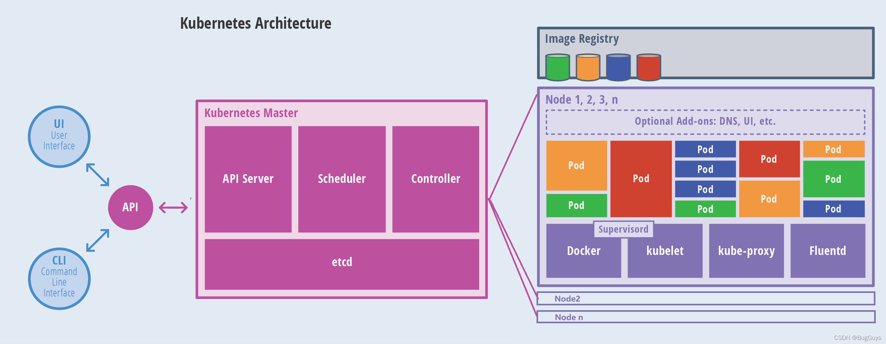
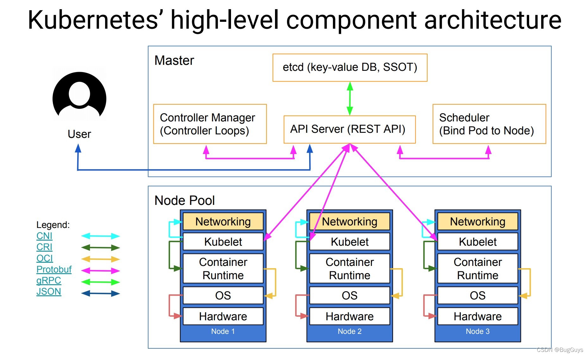
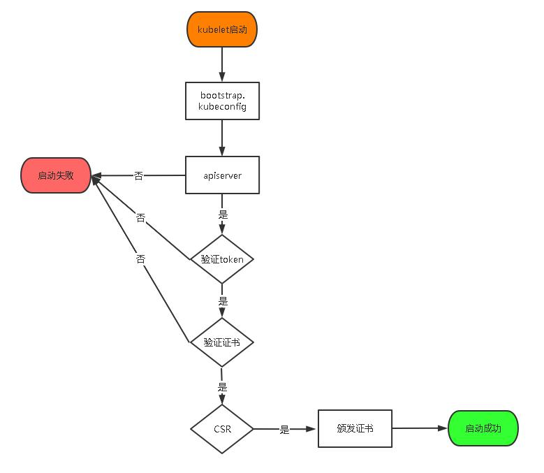
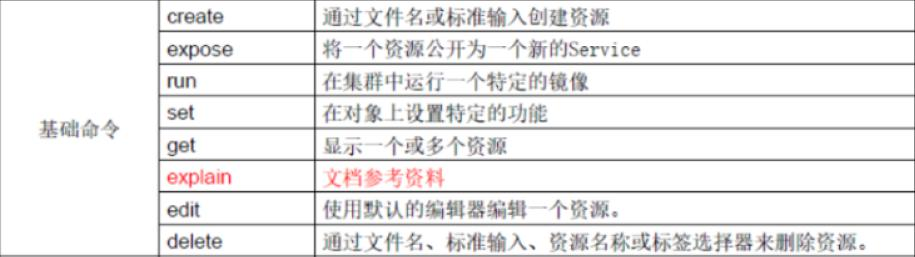
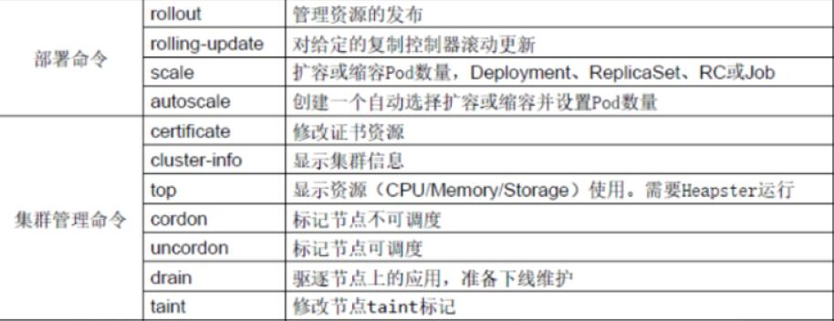
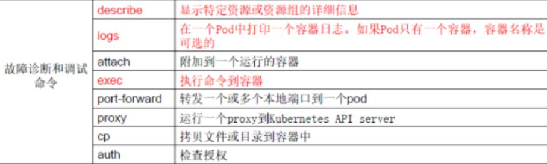
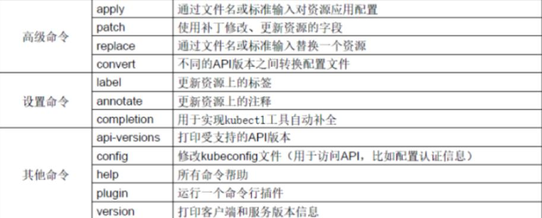

# 1、概述

Kubernetes

2014年由google开源

需要前置知识：

1、linux系统

2、Docker

视频地址

baidupan/2023/尚硅谷Kubernetes（k8s）新版


## 1.1、K8s基本介绍

kubernetes，简称K8s，是用8代替8个字符“ubernete”而成的缩写。

**是一个轻便的和可扩展的开源平台，用于管理云平台中多个主机上的容器化的应用和服务**。

Kubernetes的目标是让部署容器化的应用简单并且高效（powerful），Kubernetes提供了应用部署，规划，更新，维护的一种机制。

传统的应用部署方式是通过插件或脚本来安装应用。

这样做的缺点是**应用的运行、配置、管理、所有生存周期将与当前操作系统绑定**，这样做并不利于应用的升级更新/回滚等操作，当然也可以通过创建虚拟机的方式来实现某些功能，但是虚拟机非常重，并不利于可移植性。

新的方式是**通过部署容器方式**实现，每个容器之间互相隔离，每个容器有自己的文件系统，容器之间进程不会相互影响，能区分计算资源。

相对于虚拟机，容器能快速部署，由于容器与底层设施、机器文件系统解耦的，所以它能在不同云、不同版本操作系统间进行迁移。

容器占用资源少、部署快，每个应用可以被打包成一个容器镜像，每个应用与容器间成一对一关系也使容器有更大优势，使用容器可以在build或release的阶段，为应用创建容器镜像，因为每个应用不需要与其余的应用堆栈组合，也不依赖于生产环境基础结构，这使得从研发到测试、生产能提供一致环境。

类似地，容器比虚拟机轻量、更“透明”，这更便于监控和管理。

Kubernetes是Google开源的一个**容器编排引擎**，它支持自动化部署、大规模可伸缩、应用容器化管理。

在生产环境中部署一个应用程序时，通常要部署该应用的多个实例以便对应用请求进行负载均衡。

在Kubernetes中，我们可以创建多个容器，每个容器里面运行一个应用实例，然后通过内置的负载均衡策略，实现对这一组应用实例的管理、发现、访问，而这些细节都不需要运维人员去进行复杂的手工配置和处理。

## 1.2、功能和架构

通过Kubernetes能够进行应用的自动化部署和扩缩容。在Kubernetes中，会将组成应用的容器组合成一个逻辑单元以更易管理和发现。

Kubernetes积累了作为Google生产环境运行工作负载15年的经验，并吸收了来自于社区的最佳想法和实践。

### 1.2.1、功能

（1）自动装箱基于容器对应用运行环境的资源配置要求自动部署应用容器

（2）自我修复(自愈能力)当容器失败时，会对容器进行重启当所部署的Node节点有问题时，会对容器进行重新部署和重新调度当容器未通过监控检查时，会关闭此容器直到容器正常运行时，才会对外提供服务

（3）水平扩展通过简单的命令、用户UI界面或基于CPU等资源使用情况，对应用容器进行规模扩大或规模剪裁

（3）服务发现用户不需使用额外的服务发现机制，就能够基于Kubernetes自身能力实现服务发现和负载均衡

（4）滚动更新可以根据应用的变化，对应用容器运行的应用，进行一次性或批量式更新

（5）版本回退可以根据应用部署情况，对应用容器运行的应用，进行历史版本即时回退

（6）密钥和配置管理在不需要重新构建镜像的情况下，可以部署和更新密钥和应用配置，类似热部署。

（7）存储编排自动实现存储系统挂载及应用，特别对有状态应用实现数据持久化非常重要存储系统可以来自于本地目录、网络存储(NFS、Gluster、Ceph等)、公共云存储服务

（8）批处理提供一次性任务，定时任务；满足批量数据处理和分析的场景

### 1.2.2、应用部署架构分类
(1)无中心节点架构GlusterFS

(2)有中心节点架构HDFSK8S

### 1.2.3、k8s集群架构


[k8s中文文档](https://www.kubernetes.org.cn/kubernetes%E8%AE%BE%E8%AE%A1%E6%9E%B6%E6%9E%84)



MasterNodek8s集群控制节点，对集群进行调度管理，接受集群外用户去集群操作请求

MasterNode由APIServer、Scheduler、ClusterStateStore（ETCD数据库）和ControllerMangerServer所组成


WorkerNode集群工作节点，运行用户业务应用容器WorkerNode包含kubelet、kubeproxy和ContainerRuntime；


组件间的协议



[参考1](https://blog.csdn.net/qq_37419449/article/details/122157277)


# 2、搭建K8s集群

目前生产部署Kubernetes集群主要有两种方式：（1）kubeadmKubeadm是一个K8s部署工具，提供kubeadminit和kubeadmjoin，用于快速部署Kubernetes集群。

官方地址：https://kubernetes.io/docs/reference/setup-tools/kubeadm/kubeadm/

（2）二进制包从github下载发行版的二进制包，手动部署每个组件，组成Kubernetes集群。Kubeadm降低部署门槛，但屏蔽了很多细节，遇到问题很难排查。如果想更容易可控，推荐使用二进制包部署Kubernetes集群，虽然手动部署麻烦点，期间可以学习很多工作原理，也利于后期维护。


## 2.1、基于客户端工具Kubeadm

kubeadm是官方社区推出的一个用于快速部署kubernetes集群的工具，这个工具能通过两条指令完成一个kubernetes集群的部署：1、创建一个Master节点kubeadminit2、将Node节点加入到当前集群中`$kubeadmjoin<Master节点的IP和端口>`

安装要求在开始之前，部署Kubernetes集群机器需要满足以下几个条件：

## 2.2、基于二进制包的方式

安装要求
在开始之前，部署Kubernetes集群机器需要满足以下几个条件：

1.  一台或多台机器，操作系统CentOS7.x-86_x64
2.  硬件配置：2GB或更多RAM，2个CPU或更多CPU，硬盘30GB或更多
3.  集群中所有机器之间网络互通
4.  可以访问外网，需要拉取镜像，如果服务器不能上网，需要提前下载镜像并导入节点
5.  禁止swap分区


2、准备环境
（1）软件环境：

| 操作系统   | CentOS7.8_x64（mini） |
| ---------- | --------------------- |
| Docker     | 19-ce                 |
| Kubernetes | 1.19                  |

服务器规划：

| 角色       | IP            | 组件                                                         |
| ---------- | ------------- | ------------------------------------------------------------ |
| k8s-master | 192.168.31.71 | kube-apiserver，kube-controller-manager，kube-scheduler，etcd |
| k8s-node1  | 192.168.31.72 | kubelet，kube-proxy，dockeretcd                              |
| k8s-node2  | 192.168.31.73 | kubelet，kube-proxy，docker，etcd                            |

```shell
操作系统初始化配
#关闭防火墙
systemctlstopfirewalld
systemctldisablefirewalld

#关闭selinux
sed-i's/enforcing/disabled/'/etc/selinux/config#永久
setenforce0#临时

#关闭swap
swapoff-a#临时
sed-ri's/.*swap.*/#&/'/etc/fstab#永久

#根据规划设置主机名
hostnamectlset-hostname<hostname>#在master添加hosts
cat>>/etc/hosts<<EOF
192.168.44.147m1
192.168.44.148n1
EOF

#将桥接的IPv4流量传递到iptables的链
cat>/etc/sysctl.d/k8s.conf<<EOF
net.bridge.bridge-nf-call-ip6tables=1
net.bridge.bridge-nf-call-iptables=1
EOF
sysctl--system#生效

#时间同步
yuminstallntpdate-y
ntpdatetime.windows.com
```

部署Etcd集群
Etcd是一个分布式键值存储系统，Kubernetes使用Etcd进行数据存储，所以先准备一个Etcd数据库，为解决Etcd单点故障，应采用集群方式部署，这里使用3台组建集群，可容忍1台机器故障，当然，你也可以使用5台组建集群，可容忍2台机器故障。

| 节点名称 | IP            |
| -------- | ------------- |
| etcd-1   | 192.168.31.71 |
| etcd-2   | 192.168.31.72 |
| etcd-3   | 192.168.31.73 |

注：为了节省机器，这里与K8s节点机器复用。也可以独立于k8s集群之外部署，只要apiserver能连接到就行。

```shell
4.1准备cfssl证书生成工具
cfssl是一个开源的证书管理工具，使用json文件生成证书，相比openssl更方便使用。
找任意一台服务器操作，这里用Master节点。

wgethttps://pkg.cfssl.org/R1.2/cfssl_linux-amd64
wgethttps://pkg.cfssl.org/R1.2/cfssljson_linux-amd64
wgethttps://pkg.cfssl.org/R1.2/cfssl-certinfo_linux-amd64
chmod+xcfssl_linux-amd64cfssljson_linux-amd64cfssl-certinfo_linux-amd64
mvcfssl_linux-amd64/usr/local/bin/cfssl
mvcfssljson_linux-amd64/usr/local/bin/cfssljson
mvcfssl-certinfo_linux-amd64/usr/bin/cfssl-certinfo

4.2生成Etcd证书
（1）自签证书颁发机构（CA）
创建工作目录：
mkdir-p~/TLS/{etcd,k8s}
cdTLS/etcd
自签CA：
cat>ca-config.json<<EOF
{
"signing":{
"default":{
"expiry":"87600h"
},
"profiles":{
"www":{
"expiry":"87600h",
"usages":[
"signing","keyencipherment",
"serverauth",
"clientauth"
	]
	}
	}
	}
}
EOF

cat>ca-csr.json<<EOF
{
"CN":"etcdCA",
"key":{
"algo":"rsa",
"size":2048
	},
"names":[
{
"C":"CN",
"L":"Beijing",
"ST":"Beijing"
}
]
}
EOF

生成证书：
cfsslgencert-initcaca-csr.json|cfssljson-bareca-ls*pem
ca-key.pemca.pem
（2）使用自签CA签发EtcdHTTPS证书
创建证书申请文件：
cat>server-csr.json<<EOF
{
"CN":"etcd",
"hosts":[
"192.168.31.71",
"192.168.31.72",
"192.168.31.73"
],
"key":{
"algo":"rsa",
"size":2048
},
"names":[
{
"C":"CN",
"L":"BeiJing",
"ST":"BeiJing"
}
]
}
EOF
注：上述文件hosts字段中IP为所有etcd节点的集群内部通信IP，一个都不能少！为了
方便后期扩容可以多写几个预留的IP。

生成证书：
cfsslgencert-ca=ca.pem-ca-key=ca-key.pem-config=ca-config.json-
profile=wwwserver-csr.json|cfssljson-bareserver

lsserver*pem
server-key.pemserver.pem

4.3从Github下载二进制文件
下载地址：https://github.com/etcd-io/etcd/releases/download/v3.4.9/etcd-v3.4.9-
linux-amd64.tar.gz

4.4部署Etcd集群
以下在节点1上操作，为简化操作，待会将节点1生成的所有文件拷贝到节点2和节点3.
（1）创建工作目录并解压二进制包
mkdir/opt/etcd/{bin,cfg,ssl}–p
tarzxvfetcd-v3.4.9-linux-amd64.tar.gz
mvetcd-v3.4.9-linux-amd64/{etcd,etcdctl}/opt/etcd/bin/
（2）创建etcd配置文件
cat>/opt/etcd/cfg/etcd.conf<<EOF
#[Member]
ETCD_NAME="etcd-1"
ETCD_DATA_DIR="/var/lib/etcd/default.etcd"
ETCD_LISTEN_PEER_URLS="https://192.168.31.71:2380"
ETCD_LISTEN_CLIENT_URLS="https://192.168.31.71:2379"
#[Clustering]
ETCD_INITIAL_ADVERTISE_PEER_URLS="https://192.168.31.71:2380"
ETCD_ADVERTISE_CLIENT_URLS="https://192.168.31.71:2379"
ETCD_INITIAL_CLUSTER="etcd-1=https://192.168.31.71:2380,etcd-
2=https://192.168.31.72:2380,etcd-3=https://192.168.31.73:2380"
ETCD_INITIAL_CLUSTER_TOKEN="etcd-cluster"
ETCD_INITIAL_CLUSTER_STATE="new"
EOF

ETCD_NAME：节点名称，集群中唯一
ETCD_DATA_DIR：数据目录
ETCD_LISTEN_PEER_URLS：集群通信监听地址
ETCD_LISTEN_CLIENT_URLS：客户端访问监听地址
ETCD_INITIAL_ADVERTISE_PEER_URLS：集群通告地址
ETCD_ADVERTISE_CLIENT_URLS：客户端通告地址
ETCD_INITIAL_CLUSTER：集群节点地址
ETCD_INITIAL_CLUSTER_TOKEN：集群Token
ETCD_INITIAL_CLUSTER_STATE：加入集群的当前状态，new是新集群，existing表示加入已有集群

（3）systemd管理etcd
cat>/usr/lib/systemd/system/etcd.service<<EOF
[Unit]
Description=EtcdServer
After=network.target
After=network-online.target
Wants=network-online.target
[Service]
Type=notify
EnvironmentFile=/opt/etcd/cfg/etcd.conf
ExecStart=/opt/etcd/bin/etcd\
--cert-file=/opt/etcd/ssl/server.pem\
--key-file=/opt/etcd/ssl/server-key.pem\
--peer-cert-file=/opt/etcd/ssl/server.pem\
--peer-key-file=/opt/etcd/ssl/server-key.pem\
--trusted-ca-file=/opt/etcd/ssl/ca.pem\--peer-trusted-ca-file=/opt/etcd/ssl/ca.pem\
--logger=zap
Restart=on-failure
LimitNOFILE=65536
[Install]
WantedBy=multi-user.target
EOF

（4）拷贝刚才生成的证书
把刚才生成的证书拷贝到配置文件中的路径：
cp~/TLS/etcd/ca*pem~/TLS/etcd/server*pem/opt/etcd/ssl/

（5）启动并设置开机启动
systemctldaemon-reload
systemctlstartetcd
systemctlenableetcd

（6）将上面节点1所有生成的文件拷贝到节点2和节点3
scp-r/opt/etcd/root@192.168.31.72:/opt/
scp/usr/lib/systemd/system/etcd.service
root@192.168.31.72:/usr/lib/systemd/system/
scp-r/opt/etcd/root@192.168.31.73:/opt/
scp/usr/lib/systemd/system/etcd.service
root@192.168.31.73:/usr/lib/systemd/system/

然后在节点2和节点3分别修改etcd.conf配置文件中的节点名称和当前服务器IP：
vi/opt/etcd/cfg/etcd.conf
#[Member]
ETCD_NAME="etcd-1"#修改此处，节点2改为etcd-2，节点3改为etcd-3ETCD_DATA_DIR="/var/lib/etcd/default.etcd"
ETCD_LISTEN_PEER_URLS="https://192.168.31.71:2380"#修改此处为当前服务器IP
ETCD_LISTEN_CLIENT_URLS="https://192.168.31.71:2379"#修改此处为当前服务器IP
#[Clustering]
ETCD_INITIAL_ADVERTISE_PEER_URLS="https://192.168.31.71:2380"#修改此处为当前服务器IP
ETCD_ADVERTISE_CLIENT_URLS="https://192.168.31.71:2379"#修改此处为当前服务器IP
ETCD_INITIAL_CLUSTER="etcd-1=https://192.168.31.71:2380,etcd-2=https://192.168.31.72:2380,etcd-3=https://192.168.31.73:2380"
ETCD_INITIAL_CLUSTER_TOKEN="etcd-cluster"
ETCD_INITIAL_CLUSTER_STATE="new"

最后启动etcd并设置开机启动，同上。

（7）查看集群状态
ETCDCTL_API=3/opt/etcd/bin/etcdctl--cacert=/opt/etcd/ssl/ca.pem--
cert=/opt/etcd/ssl/server.pem--key=/opt/etcd/ssl/server-key.pem--
endpoints="https://192.168.31.71:2379,https://192.168.31.72:2379,https://192.168.31.73:2379"endpointhealth
https://192.168.31.71:2379ishealthy:successfullycommittedproposal:took=
8.154404ms
https://192.168.31.73:2379ishealthy:successfullycommittedproposal:took=
9.044117ms
https://192.168.31.72:2379ishealthy:successfullycommittedproposal:took=
10.000825ms

如果输出上面信息，就说明集群部署成功。如果有问题第一步先看日志：
/var/log/message或journalctl-uetcd
```


```shell
安装Docker
下载地址：https://download.docker.com/linux/static/stable/x86_64/docker-19.03.9.tgz
以下在所有节点操作。这里采用二进制安装，用yum安装也一样。

（1）解压二进制包
tarzxvfdocker-19.03.9.tgz
mvdocker/*/usr/bin

（2）systemd管理docker
cat>/usr/lib/systemd/system/docker.service<<EOF
[Unit]
Description=DockerApplicationContainerEngine
Documentation=https://docs.docker.com
After=network-online.targetfirewalld.service
Wants=network-online.target
[Service]
Type=notify
ExecStart=/usr/bin/dockerd
ExecReload=/bin/kill-sHUP$MAINPID
LimitNOFILE=infinity
LimitNPROC=infinity
LimitCORE=infinity
TimeoutStartSec=0
Delegate=yes
KillMode=process
Restart=on-failure
StartLimitBurst=3
StartLimitInterval=60s
[Install]
WantedBy=multi-user.target
EOF

（3）创建配置文件
mkdir/etc/docker
cat>/etc/docker/daemon.json<<EOF
{"registry-mirrors":["https://b9pmyelo.mirror.aliyuncs.com"]
}
EOF
registry-mirrors阿里云镜像加速器

（4）启动并设置开机启动
systemctldaemon-reload
systemctlstartdocker
systemctlenabledocker

6、部署MasterNode
6.1生成kube-apiserver证书
（1）自签证书颁发机构（CA）
cat>ca-config.json<<EOF
{
"signing":{
"default":{
	"expiry":"87600h"
},
"profiles":{
"kubernetes":{
"expiry":"87600h",
"usages":[
"signing",
"keyencipherment",
"serverauth",
"clientauth"
]
}
	}
}
}
EOF

cat>ca-csr.json<<EOF
{
"CN":"kubernetes",
"key":{
"algo":"rsa",
"size":2048
},
"names":[
{
"C":"CN",
"L":"Beijing",
"ST":"Beijing",
"O":"k8s",
"OU":"System"
}
]
}
EOF

（2）生成证书：
cfsslgencert-initcaca-csr.json|cfssljson-bareca-
ls*pem
ca-key.pemca.pem

（3）使用自签CA签发kube-apiserverHTTPS证书
创建证书申请文件：cdTLS/k8s
cat>server-csr.json<<EOF
{
"CN":"kubernetes",
"hosts":[
"10.0.0.1",
"127.0.0.1",
"192.168.31.71",
"192.168.31.72",
"192.168.31.73",
"192.168.31.74",
"192.168.31.81",
"192.168.31.82",
"192.168.31.88",
"kubernetes",
"kubernetes.default",
"kubernetes.default.svc",
"kubernetes.default.svc.cluster",
"kubernetes.default.svc.cluster.local"
],
"key":{
"algo":"rsa",
"size":2048
},
"names":[
{
"C":"CN",
"L":"BeiJing",
"ST":"BeiJing","O":"k8s",
"OU":"System"
}
]
}
EOF

生成证书：
cfsslgencert-ca=ca.pem-ca-key=ca-key.pem-config=ca-config.json-
profile=kubernetesserver-csr.json|cfssljson-bareserver
lsserver*pem
server-key.pemserver.pem

6.2从Github下载二进制文件
下载地址：
https://github.com/kubernetes/kubernetes/blob/master/CHANGELOG/CHANGELOG-1.18.md#v1183

注：打开链接你会发现里面有很多包，下载一个server包就够了，包含了Master和
WorkerNode二进制文件。

6.3解压二进制包
mkdir-p/opt/kubernetes/{bin,cfg,ssl,logs}
tarzxvfkubernetes-server-linux-amd64.tar.gz
cdkubernetes/server/bin
cpkube-apiserverkube-schedulerkube-controller-manager/opt/kubernetes/bin
cpkubectl/usr/bin/

6.4部署kube-apiserver
1.创建配置文件
cat>/opt/kubernetes/cfg/kube-apiserver.conf<<EOFKUBE_APISERVER_OPTS="--logtostderr=false\\
--v=2\\
--log-dir=/opt/kubernetes/logs\\
--etcdservers=https://192.168.31.71:2379,https://192.168.31.72:2379,https://192.168.3
1.73:2379\\
--bind-address=192.168.31.71\\
--secure-port=6443\\
--advertise-address=192.168.31.71\\
--allow-privileged=true\\
--service-cluster-ip-range=10.0.0.0/24\\
--enable-admissionplugins=NamespaceLifecycle,LimitRanger,ServiceAccount,ResourceQuota,NodeRestric
tion\\
--authorization-mode=RBAC,Node\\
--enable-bootstrap-token-auth=true\\
--token-auth-file=/opt/kubernetes/cfg/token.csv\\
--service-node-port-range=30000-32767\\
--kubelet-client-certificate=/opt/kubernetes/ssl/server.pem\\
--kubelet-client-key=/opt/kubernetes/ssl/server-key.pem\\
--tls-cert-file=/opt/kubernetes/ssl/server.pem\\
--tls-private-key-file=/opt/kubernetes/ssl/server-key.pem\\
--client-ca-file=/opt/kubernetes/ssl/ca.pem\\
--service-account-key-file=/opt/kubernetes/ssl/ca-key.pem\\
--etcd-cafile=/opt/etcd/ssl/ca.pem\\
--etcd-certfile=/opt/etcd/ssl/server.pem\\
--etcd-keyfile=/opt/etcd/ssl/server-key.pem\\
--audit-log-maxage=30\\
--audit-log-maxbackup=3\\
--audit-log-maxsize=100\\
--audit-log-path=/opt/kubernetes/logs/k8s-audit.log"EOF

注：上面两个\\第一个是转义符，第二个是换行符，使用转义符是为了使用EOF保留换行符。
–logtostderr：启用日志
—v：日志等级
–log-dir：日志目录
–etcd-servers：etcd集群地址
–bind-address：监听地址
–secure-port：https安全端口
–advertise-address：集群通告地址
–allow-privileged：启用授权
–service-cluster-ip-range：Service虚拟IP地址段
–enable-admission-plugins：准入控制模块
–authorization-mode：认证授权，启用RBAC授权和节点自管理
–enable-bootstrap-token-auth：启用TLSbootstrap机制
–token-auth-file：bootstraptoken文件
–service-node-port-range：Servicenodeport类型默认分配端口范围
–kubelet-client-xxx：apiserver访问kubelet客户端证书
–tls-xxx-file：apiserverhttps证书
–etcd-xxxfile：连接Etcd集群证书
–audit-log-xxx：审计日志

2.拷贝刚才生成的证书
把刚才生成的证书拷贝到配置文件中的路径：
cp~/TLS/k8s/ca*pem~/TLS/k8s/server*pem/opt/kubernetes/ssl/

3.启用TLSBootstrapping机制
TLSBootstraping：Masterapiserver启用TLS认证后，Node节点kubelet和kubeproxy要与kube-apiserver进行通信，必须使用CA签发的有效证书才可以，当Node节点很多时，这种客户端证书颁发需要大量工作，同样也会增加集群扩展复杂度。为了简化流程，Kubernetes引入了TLSbootstraping机制来自动颁发客户端证书，kubelet会以一个低权限用户自动向apiserver申请证书，kubelet的证书由apiserver动态签署。所以强烈建议在Node上使用这种方式，目前主要用于kubelet，kube-proxy还是由我们统一颁发一个证书
```

**TLSbootstraping工作流程**




```shell
创建上述配置文件中token文件：
cat>/opt/kubernetes/cfg/token.csv<<EOF
c47ffb939f5ca36231d9e3121a252940,kubelet-bootstrap,10001,"system:nodebootstrapper"
EOF格式：token，用户名，UID，用户组
token也可自行生成替换：
head-c16/dev/urandom|od-An-tx|tr-d''

4.systemd管理apiserver
cat>/usr/lib/systemd/system/kube-apiserver.service<<EOF
[Unit]
Description=KubernetesAPIServer
Documentation=https://github.com/kubernetes/kubernetes
[Service]
EnvironmentFile=/opt/kubernetes/cfg/kube-apiserver.conf
ExecStart=/opt/kubernetes/bin/kube-apiserver\$KUBE_APISERVER_OPTS
Restart=on-failure
[Install]
WantedBy=multi-user.target
EOF

5.启动并设置开机启动
systemctldaemon-reload
systemctlstartkube-apiserver
systemctlenablekube-apiserver

6.授权kubelet-bootstrap用户允许请求证书
kubectlcreateclusterrolebindingkubelet-bootstrap\
--clusterrole=system:node-bootstrapper\
--user=kubelet-bootstrap

6.5部署kube-controller-manager1.创建配置文件
cat>/opt/kubernetes/cfg/kube-controller-manager.conf<<EOF
KUBE_CONTROLLER_MANAGER_OPTS="--logtostderr=false\\
--v=2\\
--log-dir=/opt/kubernetes/logs\\
--leader-elect=true\\
--master=127.0.0.1:8080\\
--bind-address=127.0.0.1\\
--allocate-node-cidrs=true\\
--cluster-cidr=10.244.0.0/16\\
--service-cluster-ip-range=10.0.0.0/24\\
--cluster-signing-cert-file=/opt/kubernetes/ssl/ca.pem\\
--cluster-signing-key-file=/opt/kubernetes/ssl/ca-key.pem\\
--root-ca-file=/opt/kubernetes/ssl/ca.pem\\
--service-account-private-key-file=/opt/kubernetes/ssl/ca-key.pem\\
--experimental-cluster-signing-duration=87600h0m0s"
EOF

–master：通过本地非安全本地端口8080连接apiserver。
–leader-elect：当该组件启动多个时，自动选举（HA）
–cluster-signing-cert-file/–cluster-signing-key-file：自动为kubelet颁发证书
的CA，与apiserver保持一致

2.systemd管理controller-manager
cat>/usr/lib/systemd/system/kube-controller-manager.service<<EOF
[Unit]
Description=KubernetesControllerManager
Documentation=https://github.com/kubernetes/kubernetes
[Service]
EnvironmentFile=/opt/kubernetes/cfg/kube-controller-manager.conf
ExecStart=/opt/kubernetes/bin/kube-controller-manager\$KUBE_CONTROLLER_MANAGER_OPTS
Restart=on-failure
[Install]
WantedBy=multi-user.target
EOF

3.启动并设置开机启动
systemctldaemon-reload
systemctlstartkube-controller-manager
systemctlenablekube-controller-manager

6.6部署kube-scheduler
1.创建配置文件
cat>/opt/kubernetes/cfg/kube-scheduler.conf<<EOF
KUBE_SCHEDULER_OPTS="--logtostderr=false\
--v=2\
--log-dir=/opt/kubernetes/logs\
--leader-elect\
--master=127.0.0.1:8080\
--bind-address=127.0.0.1"
EOF
–master：通过本地非安全本地端口8080连接apiserver。
–leader-elect：当该组件启动多个时，自动选举（HA）

2.systemd管理scheduler
cat>/usr/lib/systemd/system/kube-scheduler.service<<EOF
[Unit]
Description=KubernetesScheduler
Documentation=https://github.com/kubernetes/kubernetes[Service]
EnvironmentFile=/opt/kubernetes/cfg/kube-scheduler.conf
ExecStart=/opt/kubernetes/bin/kube-scheduler\$KUBE_SCHEDULER_OPTS
Restart=on-failure
[Install]
WantedBy=multi-user.target
EOF

3.启动并设置开机启动
systemctldaemon-reload
systemctlstartkube-scheduler
systemctlenablekube-scheduler

4.查看集群状态
所有组件都已经启动成功，通过kubectl工具查看当前集群组件状态：
kubectlgetcs
NAMESTATUSMESSAGEERROR
schedulerHealthyok
controller-managerHealthyok
etcd-2Healthy{"health":"true"}
etcd-1Healthy{"health":"true"}
etcd-0Healthy{"health":"true"}
如上输出说明Master节点组件运行正常。

7、部署WorkerNode
下面还是在MasterNode上操作，即同时作为WorkerNode
7.1创建工作目录并拷贝二进制文件
在所有workernode创建工作目录：
mkdir-p/opt/kubernetes/{bin,cfg,ssl,logs}
从master节点拷贝：cdkubernetes/server/bin
cpkubeletkube-proxy/opt/kubernetes/bin#本地拷贝
7.2部署kubelet

1.创建配置文件
cat>/opt/kubernetes/cfg/kubelet.conf<<EOF
KUBELET_OPTS="--logtostderr=false\\
--v=2\\
--log-dir=/opt/kubernetes/logs\\
--hostname-override=k8s-master\\
--network-plugin=cni\\
--kubeconfig=/opt/kubernetes/cfg/kubelet.kubeconfig\\
--bootstrap-kubeconfig=/opt/kubernetes/cfg/bootstrap.kubeconfig\\
--config=/opt/kubernetes/cfg/kubelet-config.yml\\
--cert-dir=/opt/kubernetes/ssl\\
--pod-infra-container-image=lizhenliang/pause-amd64:3.0"
EOF

–hostname-override：显示名称，集群中唯一
–network-plugin：启用CNI
–kubeconfig：空路径，会自动生成，后面用于连接apiserver
–bootstrap-kubeconfig：首次启动向apiserver申请证书
–config：配置参数文件
–cert-dir：kubelet证书生成目录
–pod-infra-container-image：管理Pod网络容器的镜像

2.配置参数文件
cat>/opt/kubernetes/cfg/kubelet-config.yml<<EOF
kind:KubeletConfiguration
apiVersion:kubelet.config.k8s.io/v1beta1address:0.0.0.0
port:10250
readOnlyPort:10255
cgroupDriver:cgroupfs
clusterDNS:
-10.0.0.2
clusterDomain:cluster.local
failSwapOn:false
authentication:
anonymous:
enabled:false
webhook:
cacheTTL:2m0s
enabled:true
x509:
clientCAFile:/opt/kubernetes/ssl/ca.pem
authorization:
mode:Webhook
webhook:
cacheAuthorizedTTL:5m0s
cacheUnauthorizedTTL:30s
evictionHard:
imagefs.available:15%
memory.available:100Mi
nodefs.available:10%
nodefs.inodesFree:5%
maxOpenFiles:1000000
maxPods:110
EOF

3.生成bootstrap.kubeconfig文件
KUBE_APISERVER="https://192.168.31.71:6443"#apiserverIP:PORT
TOKEN="c47ffb939f5ca36231d9e3121a252940"#与token.csv里保持一致
#生成kubeletbootstrapkubeconfig配置文件
kubectlconfigset-clusterkubernetes\
--certificate-authority=/opt/kubernetes/ssl/ca.pem\
--embed-certs=true\
--server=${KUBE_APISERVER}\
--kubeconfig=bootstrap.kubeconfig
kubectlconfigset-credentials"kubelet-bootstrap"\
--token=${TOKEN}\
--kubeconfig=bootstrap.kubeconfig
kubectlconfigset-contextdefault\
--cluster=kubernetes\
--user="kubelet-bootstrap"\
--kubeconfig=bootstrap.kubeconfig
kubectlconfiguse-contextdefault--kubeconfig=bootstrap.kubeconfig

拷贝到配置文件路径：
cpbootstrap.kubeconfig/opt/kubernetes/cfg

4.systemd管理kubelet
cat>/usr/lib/systemd/system/kubelet.service<<EOF
[Unit]
Description=KubernetesKubelet
After=docker.service
[Service]
EnvironmentFile=/opt/kubernetes/cfg/kubelet.confExecStart=/opt/kubernetes/bin/kubelet\$KUBELET_OPTS
Restart=on-failure
LimitNOFILE=65536
[Install]
WantedBy=multi-user.target
EOF

5.启动并设置开机启动
systemctldaemon-reload
systemctlstartkubelet
systemctlenablekubelet

7.3批准kubelet证书申请并加入集群
#查看kubelet证书请求
kubectlgetcsr
NAMEAGESIGNERNAME
REQUESTORCONDITION
node-csr-uCEGPOIiDdlLODKts8J658HrFq9CZ--K6M4G7bjhk8A6m3s
kubernetes.io/kube-apiserver-client-kubeletkubelet-bootstrapPending
#批准申请
kubectlcertificateapprovenode-csr-uCEGPOIiDdlLODKts8J658HrFq9CZ--
K6M4G7bjhk8A

#查看节点
kubectlgetnode
注：由于网络插件还没有部署，节点会没有准备就绪NotReady

7.4部署kube-proxy

1.创建配置文件cat>/opt/kubernetes/cfg/kube-proxy.conf<<EOF
KUBE_PROXY_OPTS="--logtostderr=false\\
--v=2\\
--log-dir=/opt/kubernetes/logs\\
--config=/opt/kubernetes/cfg/kube-proxy-config.yml"
EOF

2.配置参数文件
cat>/opt/kubernetes/cfg/kube-proxy-config.yml<<EOF
kind:KubeProxyConfiguration
apiVersion:kubeproxy.config.k8s.io/v1alpha1
bindAddress:0.0.0.0
metricsBindAddress:0.0.0.0:10249
clientConnection:
kubeconfig:/opt/kubernetes/cfg/kube-proxy.kubeconfig
hostnameOverride:k8s-master
clusterCIDR:10.0.0.0/24
EOF

3.生成kube-proxy.kubeconfig文件
生成kube-proxy证书：
#切换工作目录
cdTLS/k8s

#创建证书请求文件
cat>kube-proxy-csr.json<<EOF
{
"CN":"system:kube-proxy",
"hosts":[],
"key":{
"algo":"rsa",
"size":2048
},
"names":[
{
"C":"CN",
"L":"BeiJing",
"ST":"BeiJing",
"O":"k8s",
"OU":"System"
}
]
}
EOF

#生成证书
cfsslgencert-ca=ca.pem-ca-key=ca-key.pem-config=ca-config.json-
profile=kuberneteskube-proxy-csr.json|cfssljson-barekube-proxy
lskube-proxy*pem
kube-proxy-key.pemkube-proxy.pem
生成kubeconfig文件：
KUBE_APISERVER="https://192.168.31.71:6443"
kubectlconfigset-clusterkubernetes\
--certificate-authority=/opt/kubernetes/ssl/ca.pem\
--embed-certs=true\
--server=${KUBE_APISERVER}\--kubeconfig=kube-proxy.kubeconfig
kubectlconfigset-credentialskube-proxy\
--client-certificate=./kube-proxy.pem\
--client-key=./kube-proxy-key.pem\
--embed-certs=true\
--kubeconfig=kube-proxy.kubeconfig
kubectlconfigset-contextdefault\
--cluster=kubernetes\
--user=kube-proxy\
--kubeconfig=kube-proxy.kubeconfig
kubectlconfiguse-contextdefault--kubeconfig=kube-proxy.kubeconfig

拷贝到配置文件指定路径：
cpkube-proxy.kubeconfig/opt/kubernetes/cfg/

4.systemd管理kube-proxy
cat>/usr/lib/systemd/system/kube-proxy.service<<EOF
[Unit]
Description=KubernetesProxy
After=network.target
[Service]
EnvironmentFile=/opt/kubernetes/cfg/kube-proxy.conf
ExecStart=/opt/kubernetes/bin/kube-proxy\$KUBE_PROXY_OPTS
Restart=on-failure
LimitNOFILE=65536
[Install]
WantedBy=multi-user.target
EOF

5.启动并设置开机启动systemctldaemon-reload
systemctlstartkube-proxy
systemctlenablekube-proxy

7.5部署CNI网络
先准备好CNI二进制文件：
下载地址：
https://github.com/containernetworking/plugins/releases/download/v0.8.6/cniplugins-linux-amd64-v0.8.6.tgz
解压二进制包并移动到默认工作目录：
mkdir/opt/cni/bin
tarzxvfcni-plugins-linux-amd64-v0.8.6.tgz-C/opt/cni/bin
部署CNI网络：
wget
https://raw.githubusercontent.com/coreos/flannel/master/Documentation/kubeflannel.yml
sed-i-r"s#quay.io/coreos/flannel:.*-amd64#lizhenliang/flannel:v0.12.0-
amd64#g"kube-flannel.yml
默认镜像地址无法访问，修改为dockerhub镜像仓库。
kubectlapply-fkube-flannel.yml
kubectlgetpods-nkube-system
kubectlgetnode
部署好网络插件，Node准备就绪。

7.6授权apiserver访问kubelet
cat>apiserver-to-kubelet-rbac.yaml<<EOF
apiVersion:rbac.authorization.k8s.io/v1
kind:ClusterRolemetadata:
annotations:
rbac.authorization.kubernetes.io/autoupdate:"true"
labels:
kubernetes.io/bootstrapping:rbac-defaults
name:system:kube-apiserver-to-kubelet
rules:
-apiGroups:
-""
resources:
-nodes/proxy
-nodes/stats
-nodes/log
-nodes/spec
-nodes/metrics
-pods/log
verbs:
-"*"
---
apiVersion:rbac.authorization.k8s.io/v1
kind:ClusterRoleBinding
metadata:
name:system:kube-apiserver
namespace:""
roleRef:
apiGroup:rbac.authorization.k8s.io
kind:ClusterRole
name:system:kube-apiserver-to-kubelet
subjects:-apiGroup:rbac.authorization.k8s.io
kind:User
name:kubernetes
EOF
kubectlapply-fapiserver-to-kubelet-rbac.yaml

7.7新增加WorkerNode
1.拷贝已部署好的Node相关文件到新节点
在master节点将WorkerNode涉及文件拷贝到新节点192.168.31.72/73
scp-r/opt/kubernetesroot@192.168.31.72:/opt/
scp-r/usr/lib/systemd/system/{kubelet,kube-proxy}.service
root@192.168.31.72:/usr/lib/systemd/system
scp-r/opt/cni/root@192.168.31.72:/opt/
scp/opt/kubernetes/ssl/ca.pemroot@192.168.31.72:/opt/kubernetes/ssl
2.删除kubelet证书和kubeconfig文件
rm/opt/kubernetes/cfg/kubelet.kubeconfig
rm-f/opt/kubernetes/ssl/kubelet*
注：这几个文件是证书申请审批后自动生成的，每个Node不同，必须删除重新生成。

3.修改主机名
vi/opt/kubernetes/cfg/kubelet.conf
--hostname-override=k8s-node1vi/opt/kubernetes/cfg/kube-proxy-config.yml
hostnameOverride:k8s-node1

4.启动并设置开机启动
systemctldaemon-reload
systemctlstartkubelet
systemctlenablekubelet
systemctlstartkube-proxy
systemctlenablekube-proxy

5.在Master上批准新Nodekubelet证书申请
kubectlgetcsr
NAMEAGESIGNERNAME
REQUESTORCONDITION
node-csr-4zTjsaVSrhuyhIGqsefxzVoZDCNKei-aE2jyTP81Uro89s
kubernetes.io/kube-apiserver-client-kubeletkubelet-bootstrapPending
kubectlcertificateapprovenode-csr-4zTjsaVSrhuyhIGqsefxzVoZDCNKeiaE2jyTP81Uro

6.查看Node状态
Kubectlgetnode
Node2（192.168.31.73）节点同上。记得修改主机名！

```


# 3、核心技术


##  3.1、Yaml文件

[Yaml-learn.md]

k8s集群中对资源管理和资源对象编排部署都可以通过声明样式（YAML）文件来解决，也就是可以把需要对资源对象操作编辑到YAML格式文件中，我们把这种文件叫做资源清单文件，通过kubectl命令直接使用资源清单文件就可以实现对大量的资源对象进行编排部署了。

## 3.2、资源清单描述

在k8s中，一般使用YAML格式的文件来创建符合我们预期期望的pod,这样的YAML文件称为资源清单。

### 3.2.1、常用字段
**必须存在的字段**

如果写不全是不让运行pod的

| 参数名                 | 字段类型 | 说明                                                         |
| :--------------------- | :------- | :----------------------------------------------------------- |
| version                | String   | 这里是指的k8sAPI的版本，目前基本是v1，可以用kubectlapi-version命令查询 |
| kind                   | String   | 这里指的是yam文件定义的资源类型和角色，比如：Pod             |
| metadata               | Object   | 元数据对象，固定值就写metadata                               |
| metadata.name          | String   | 元数据对象的名字，这里由我们编写，比如如名POd的名字          |
| metadatanamespace      | String   | 元数据对象的命名空间，由我们自身定义                         |
| spec                   | Object   | 详细定义对象，固定值就写Spec                                 |
| speccontainers[]       | list     | 这里是Spec对象的容器列表定义，是个列表                       |
| speccontainers[].name  | String   | 这里定义容器的名字                                           |
| speccontainers[].image | String   | 这里定义要用到的镜像名称                                     |

**主要对象**

**主要：**一下内容可以有可以没有，如果没有写系统会添加默认值

| 参数名                                     | 字段类型 | 说明                                                         |
| :----------------------------------------- | :------- | :----------------------------------------------------------- |
| speccontainers[].name                      | String   | 定义容器的名字                                               |
| speccontainers[].image                     | String   | 定义要用到的镜像名称                                         |
| speccontainers[].imagePullPolicy           | String   | 走义镜像拉取策路，有Always、NeverIfNotPresent三个值可选（1)Always：意思是每次都芸试重新拉取镜像（2)Never：表示仅使用本地镜像（3)IfNotPresent：如果本地有镜像就使用本地镜像，没有就拉取在线镜像。上面三个值都没设置的话，默认是Always。 |
| speccontainers[].command[]                 | list     | 指走容器启动命令，因为是数组可以指定多个，不指定则使用镜像打包时使用的启动命令。 |
| speccontainers[].args[]                    | list     | 指定容器启动命令参数，因为是数组可以指定多个。               |
| speccontainers[].workingDir                | String   | 指定容器的工作目录                                           |
| speccontainers[].volumeMounts[]            | list     | 指定容器内部的存储卷配置                                     |
| speccontainers[].volumeMounts[].name       | String   | 指定可以被容器挂载的存储卷的名称                             |
| speccontainers[].volumeMounts[].mountrPath | String   | 指定可以被容挂载的存储芢的路径                               |
| speccontainers[].volumeMounts[].readOnly   | String   | 设置存储卷路径的读写模式，ture或者false,认为读写模式         |
| speccontainers[].ports[]                   | list     | 指走容器需要用到的满口列表                                   |
| speccontainers[].ports[].name              | String   | 指定端口名称                                                 |
| speccontainers[].ports[].containerPort     | String   | 指定容器需要监听的端口号                                     |
| speccontainers[].ports[].hostPort          | String   | 首定容器所在主机需要监听的端口号，默认跟上面containerPort相同，注意设置了hostPort同一台主机无法启动该容器的相同副本（因为主机的端口号不能相同，这样会冲突) |
| speccontainers[].ports[].protocol          | String   | 指定端口协议，支持TCP和UDP，认值为TCP                        |
| speccontainers[].env[]                     | list     | 指定容器运行前需设置的环境变量列表                           |
| speccontainers[].env[].name                | String   | 指定环境变量名称                                             |
| speccontainers[].env[]value                | String   | 指走环境变量值                                               |
| speccontainers[].resources                 | Object   | 指定资源限制和源请求的值（这里开始就是设置容器的资源上限)    |
| speccontainers[].resources.limits          | Object   | 指定设置容器运行时资源的运行上限                             |
| speccontainers[].resources.limits.cpu      | String   | 指定CPU的限制，单位为core数，将用于dockerrun-cpu-shares参数（这里前面文章Pod资源限制有讲过） |
| speccontainers[].resources.limits.memory   | String   | 指定MEM内存的限制，单位为MIB、GiB                            |
| speccontainers[].resources.requests        | Object   | 指定容器启动和调度时的限制设置                               |
| speccontainers[].resources.requests.cpu    | String   | CPU请求，单位为core数，容器启动时初始化可用数量              |
| speccontainers[].resources.requestsmemory  | String   | 内存请求，单位为MIB、GiB，容器启动的初始化可用数量           |

**额外的参数项**

| 参数名                | 字段类型 | 说明                                                         |
| :-------------------- | :------- | :----------------------------------------------------------- |
| spec.restartPolicy    | String   | 定义Pod的重启策路，可选值为Alays、Onfailure，默认值为Always。1Always:Pod-且终止运行，则无论容器是如何终止的，kubelet服务都将重启它。2.failure：只有Pod以非零退出码终止时，kubeletオ会重启该容器。如果容器正常结束（退出码为0),则kubelet将不会重启它3.Never:Pod终止后，kubelet将退出码报告给Master，不会重启该Pod |
| spec.nodeSelector     | Object   | 定义Node的Labe过滤标签，以key:value格式指定                  |
| spec.imagePullSecrets | Object   | 定义pu像时便用secrets名称，以namesecretkey格式指定           |
| spec.hostNetwork      | Boolean  | 定义是否使用主机网络模式，默认值为false。设置true表示使用宿主机网络，不使用docker网桥，同时设置了tue将无法在同一台宿主机上启动第二个副本。 |

[参考2](https://cloud.tencent.com/developer/article/1785203)

创建一个namespace

```yaml
[root@k8s-master01~]#vimpod.yaml
apiVersion:v1
kind:Namespace
metadata:
name:my-namespace
```


创建一个Pod

```yaml
[root@k8s-master01~]#vimpod.yaml
apiVersion:v1
kind:Pod
metadata:
name:myapp-pod
labels:
app:myapp
version:v1
spec:
containers:
-name:app
image:hub.dashujulaoge.com/library/myapp:v1
```


## 3.2、Kubectl命令行工具

kubectl是Kubernetes集群的命令行工具，通过kubectl能够对集群本身进行管理，并能够在集群上进行容器化应用的安装部署。

官网地址：

https://kubernetes.io/docs/reference/kubectl/overview/

kubectlflags：

https://kubernetes.io/docs/reference/kubectl/kubectl/

中文社区文档：

https://www.kubernetes.org.cn/doc-50


命令的语法

```shell
kubectl[command][TYPE][NAME][flags]
```

（1）comand：指定要对资源执行的操作，例如create、get、describe和delete
（2）TYPE：指定资源类型，资源类型是大小写敏感的，开发者能够以单数、复数和缩略的
形式。例如：

```shell
$kubectlgetpodpod1
$kubectlgetpodspodpod1
$kubectlgetpopod1
```

（3）NAME：指定资源的名称，名称也大小写敏感的。如果省略名称，则会显示所有的资源，
例如:`$kubectlgetpods`

（4）flags：指定可选的参数。例如，可用-s或者–server参数指定KubernetesAPI
server的地址和端口。

`kubectl--help`获取更多信息


基础命令



部署和集群管理命令



故障和调试命令



其他命令




[参考1](https://kubernetes.io/zh-cn/docs/reference/kubectl/)

kubectl子命令使用分类

[参考2](https://cloud.tencent.com/developer/article/1718395)

查看类命令

```shell
1#获取节点和服务版本信息
2kubectlgetnodes
3#获取节点和服务版本信息，并查看附加信息
4kubectlgetnodes-owide
5
6#获取pod信息，默认是default名称空间
7kubectlgetpod
8#获取pod信息，默认是default名称空间，并查看附加信息【如：pod的IP及在哪个节点运行】
9kubectlgetpod-owide
10#获取指定名称空间的pod
11kubectlgetpod-nkube-system
12#获取指定名称空间中的指定pod
13kubectlgetpod-nkube-systempodName
14#获取所有名称空间的pod
15kubectlgetpod-A
16#查看pod的详细信息，以yaml格式或json格式显示
17kubectlgetpods-oyaml
18kubectlgetpods-ojson
19
20#查看pod的标签信息
21kubectlgetpod-A--show-labels
22#根据Selector（labelquery）来查询pod
23kubectlgetpod-A--selector="k8s-app=kube-dns"
24
25#查看运行pod的环境变量
26kubectlexecpodNameenv
27#查看指定pod的日志
28kubectllogs-f--tail500-nkube-systemkube-apiserver-k8s-master
29
30#查看所有名称空间的service信息
31kubectlgetsvc-A
32#查看指定名称空间的service信息
33kubectlgetsvc-nkube-system
34
35#查看componentstatuses信息
36kubectlgetcs
37#查看所有configmaps信息
38kubectlgetcm-A
39#查看所有serviceaccounts信息
40kubectlgetsa-A
41#查看所有daemonsets信息
42kubectlgetds-A
43#查看所有deployments信息
44kubectlgetdeploy-A
45#查看所有replicasets信息
46kubectlgetrs-A
47#查看所有statefulsets信息
48kubectlgetsts-A
49#查看所有jobs信息
50kubectlgetjobs-A
51#查看所有ingresses信息
52kubectlgeting-A
53#查看有哪些名称空间
54kubectlgetns
55
56#查看pod的描述信息
57kubectldescribepodpodName
58kubectldescribepod-nkube-systemkube-apiserver-k8s-master
59#查看指定名称空间中指定deploy的描述信息
60kubectldescribedeploy-nkube-systemcoredns
61
62#查看node或pod的资源使用情况
63#需要heapster或metrics-server支持
64kubectltopnode
65kubectltoppod
66
67#查看集群信息
68kubectlcluster-info或kubectlcluster-infodump
69#查看各组件信息【172.16.1.110为master机器】
70kubectl-shttps://172.16.1.110:6443getcomponentstatuses
```

操作类命令

```shell
1#创建资源
2kubectlcreate-fxxx.yaml
3#应用资源
4kubectlapply-fxxx.yaml
5#应用资源，该目录下的所有.yaml,.yml,或.json文件都会被使用
6kubectlapply-f<directory>
7#创建test名称空间
8kubectlcreatenamespacetest
9
10#删除资源
11kubectldelete-fxxx.yaml
12kubectldelete-f<directory>
13#删除指定的pod
14kubectldeletepodpodName
15#删除指定名称空间的指定pod
16kubectldeletepod-ntestpodName
17#删除其他资源
18kubectldeletesvcsvcName
19kubectldeletedeploydeployName
20kubectldeletensnsName
21#强制删除
22kubectldeletepodpodName-nnsName--grace-period=0--force
23kubectldeletepodpodName-nnsName--grace-period=1
24kubectldeletepodpodName-nnsName--now
25
26#编辑资源
27kubectleditpodpodName
```

进阶命令操作

```shell
1#kubectlexec：进入pod启动的容器
2kubectlexec-itpodName-nnsName/bin/sh#进入容器
3kubectlexec-itpodName-nnsName/bin/bash#进入容器
4
5#kubectllabel：添加label值
6kubectllabelnodesk8s-node01zone=north#为指定节点添加标签
7kubectllabelnodesk8s-node01zone-#为指定节点删除标签
8kubectllabelpodpodName-nnsNamerole-name=test#为指定pod添加标签
9kubectllabelpodpodName-nnsNamerole-name=dev--overwrite#修改lable标签值
10kubectllabelpodpodName-nnsNamerole-name-#删除lable标签
11
12#kubectl滚动升级；通过kubectlapply-fmyapp-deployment-v1.yaml启动deploy
13kubectlapply-fmyapp-deployment-v2.yaml#通过配置文件滚动升级
14kubectlsetimagedeploy/myapp-deploymentmyapp="registry.cn-beijing.aliyuncs.com/google_registry/myapp:v3"#通过命令滚动升级
15kubectlrolloutundodeploy/myapp-deployment或者kubectlrolloutundodeploymyapp-deployment#pod回滚到前一个版本
16kubectlrolloutundodeploy/myapp-deployment--to-revision=2#回滚到指定历史版本
17
18#kubectlscale：动态伸缩
19kubectlscaledeploymyapp-deployment--replicas=5#动态伸缩
20kubectlscale--replicas=8-fmyapp-deployment-v2.yaml#动态伸缩【根据资源类型和名称伸缩，其他配置「如：镜像版本不同」不生效】
```

上面滚动更新和动态伸缩涉及的deploy的yaml文件

```yaml
1[root@k8s-masterdeploy]#catmyapp-deployment-v1.yaml
2apiVersion:apps/v1
3kind:Deployment
4metadata:
5name:myapp-deployment
6labels:
7app:myapp
8spec:
9replicas:10
10#重点关注该字段
11selector:
12matchLabels:
13app:myapp
14template:
15metadata:
16labels:
17app:myapp
18spec:
19containers:
20-name:myapp
21image:registry.cn-beijing.aliyuncs.com/google_registry/myapp:v1
22ports:
23-containerPort:80
24
25[root@k8s-masterdeploy]#
26[root@k8s-masterdeploy]#catmyapp-deployment-v2.yaml
27apiVersion:apps/v1
28kind:Deployment
29metadata:
30name:myapp-deployment
31labels:
32app:myapp
33spec:
34replicas:10
35#重点关注该字段
36selector:
37matchLabels:
38app:myapp
39template:
40metadata:
41labels:
42app:myapp
43spec:
44containers:
45-name:myapp
46image:registry.cn-beijing.aliyuncs.com/google_registry/myapp:v2
47ports:
48-containerPort:80
```


## 3.1、Pod

Label


Controller控制器

Volume

PVC和PV

Secret和ConfigMap

NameSpace

探针

调度器

集群安装机制RABC

Helm


Service

Ingress

RABC

Helm

持久化存储

搭建集群监控平台系统


搭建高可用K8s集群


在集群环境中部署项目


